# Project Features

## 1. MCQs For Interaction and educational purpose

### Challenging Quizzes

+ The Orrery Web App features a comprehensive library of multiple-choice questions (MCQs) covering a wide range of topics related to astronomy and planetary science. 

+ These quizzes are designed to engage users in a fun and interactive way, helping to reinforce their understanding of celestial concepts.

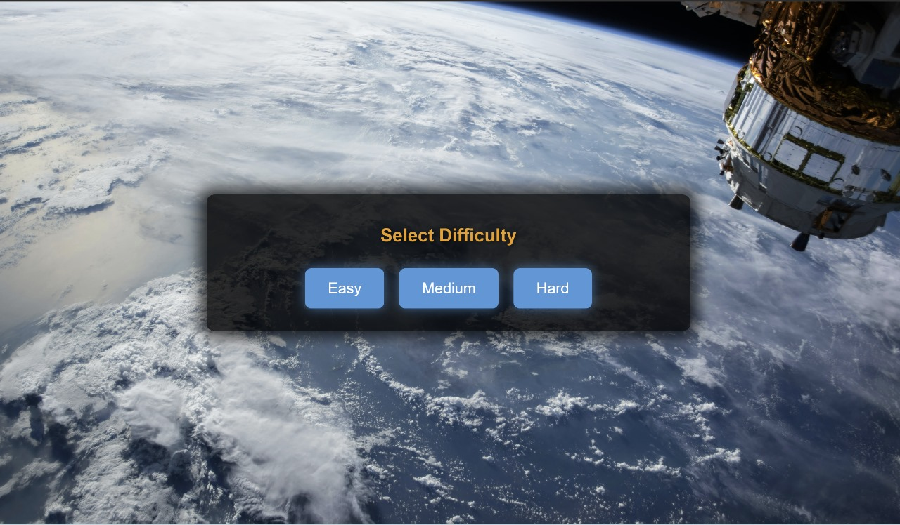

 
 

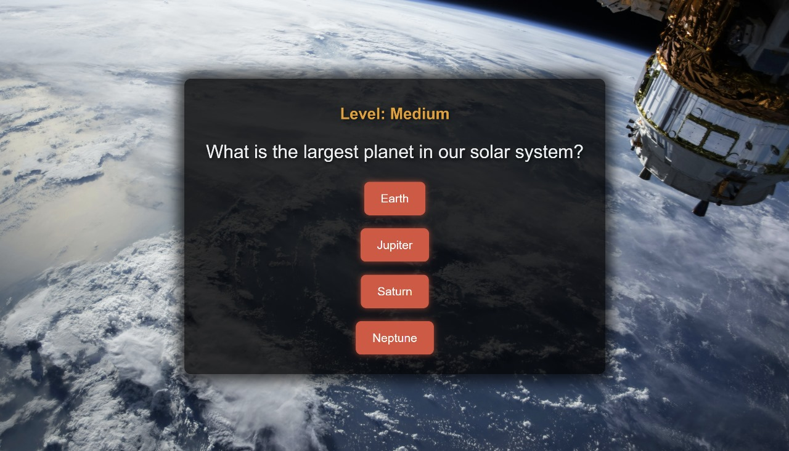

 
 

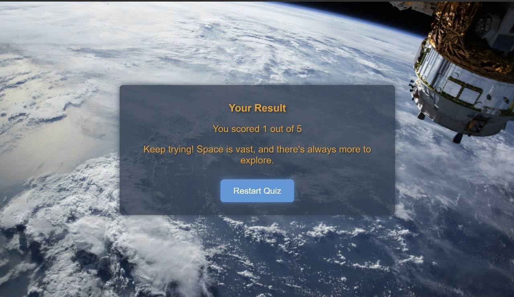

## 2. Text-to-Speech

### Enhanced Readability

+ The text-to-speech feature also benefits users who prefer to consume information through audio, or those who wish to multitask while exploring the app's content. 

+ By providing a seamless audio alternative, the Orrery Web App caters to diverse learning preferences and enhances the overall user experience.

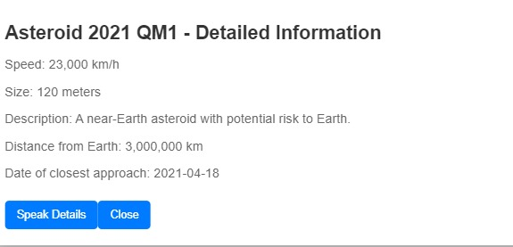

 
 

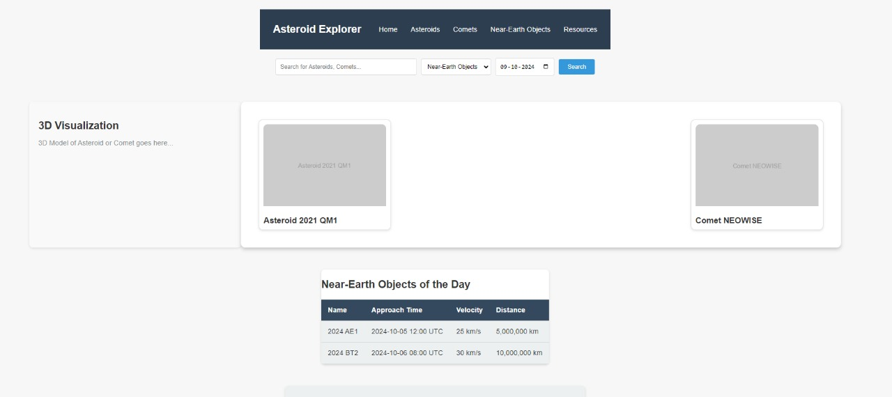

 
 

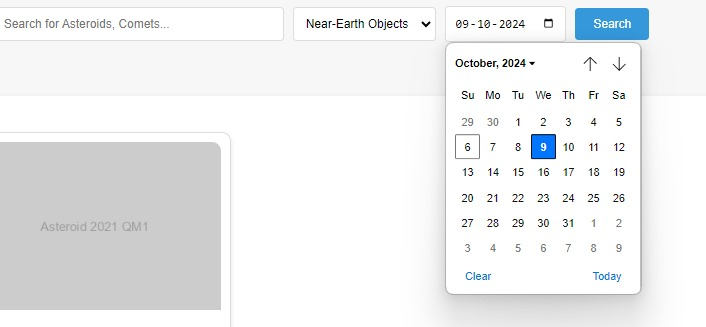

## 3. NASA API 

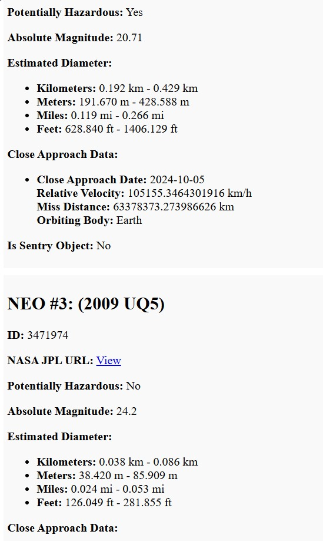

 
 

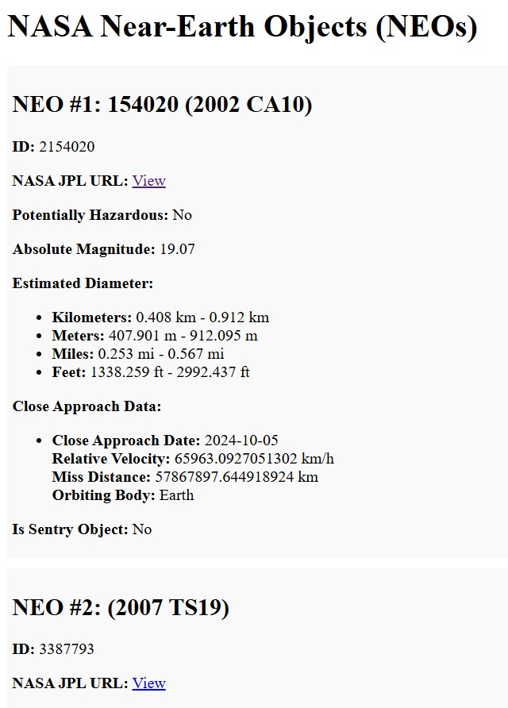

 

## 4. Card View Of images for detailed information

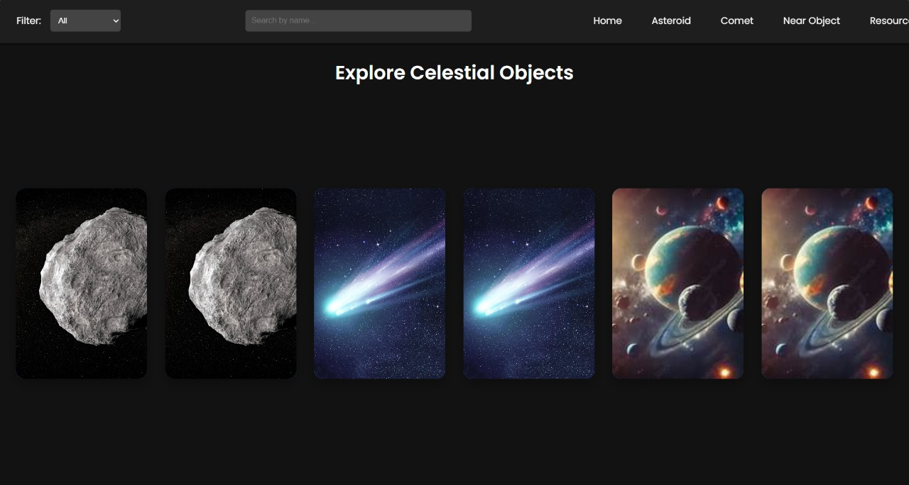

 
 

## Final Touch up for the webpage and landpage look

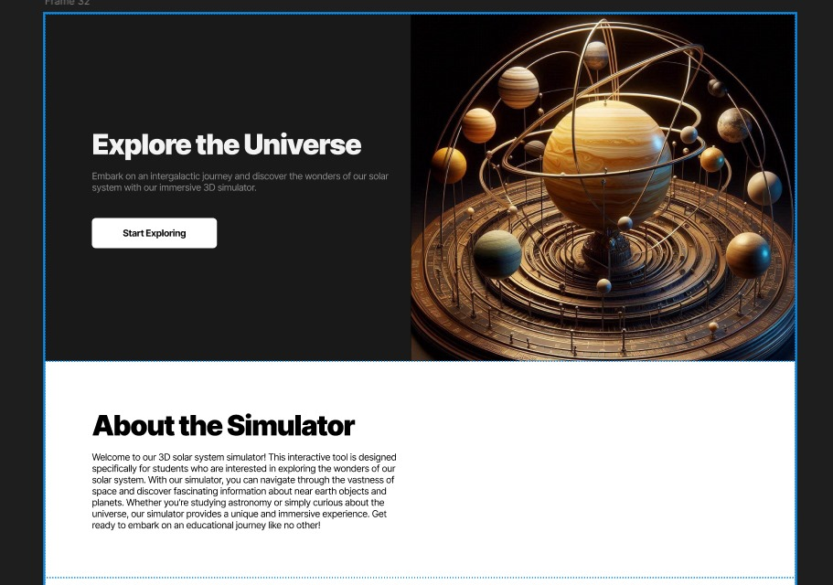

 
 

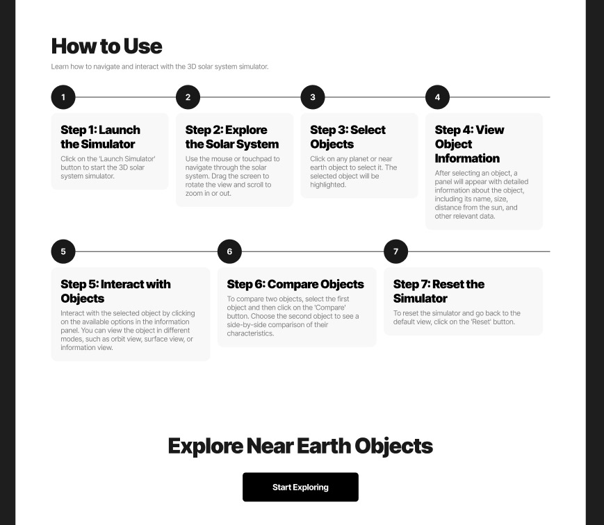

 
 

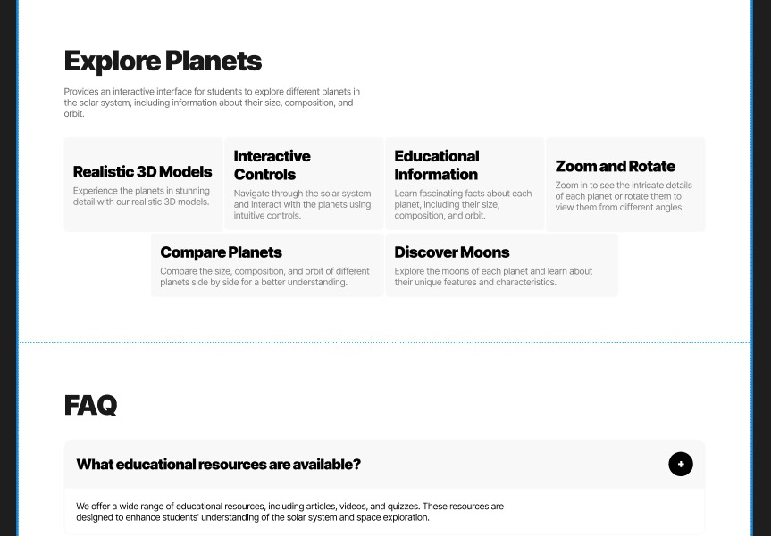

 
 
